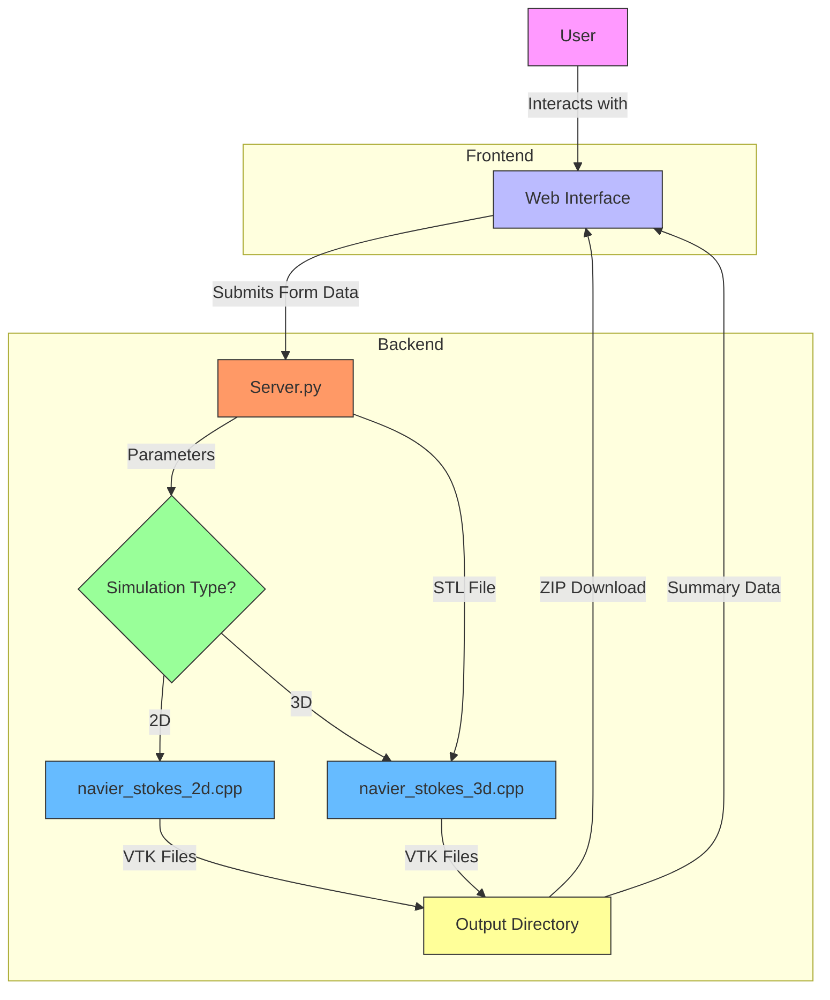

```mermaid
flowchart TD
    A[User] -->|Interacts with| B[Web Interface]
    B -->|Submits Form Data| C[Server.py]
    C -->|Parameters| D{Simulation Type?}
    D -->|2D| E[navier_stokes_2d.cpp]
    D -->|3D| F[navier_stokes_3d.cpp]
    E -->|VTK Files| G[Output Directory]
    F -->|VTK Files| G
    C -->|STL File| F
    G -->|ZIP Download| B
    G -->|Summary Data| B
    
    subgraph Frontend
        B[Web Interface]
    end
    
    subgraph Backend
        C[Server.py]
        D{Simulation Type?}
        E[navier_stokes_2d.cpp]
        F[navier_stokes_3d.cpp]
        G[Output Directory]
    end
    
    style A fill:#f9f,stroke:#333
    style B fill:#bbf,stroke:#333
    style C fill:#f96,stroke:#333
    style D fill:#9f9,stroke:#333
    style E fill:#6bf,stroke:#333
    style F fill:#6bf,stroke:#333
    style G fill:#ff9,stroke:#333
```
