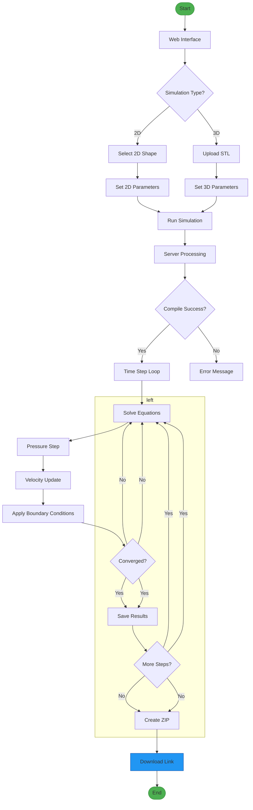

```mermaid
flowchart TD
    A([Start]) --> B[Web Interface]
    B --> C{Simulation Type?}
    C -->|2D| D[Select 2D Shape]
    C -->|3D| E[Upload STL]
    D --> F[Set 2D Parameters]
    E --> G[Set 3D Parameters]
    F --> H[Run Simulation]
    G --> H
    H --> I[Server Processing]
    I --> J{Compile Success?}
    J -->|Yes| K[Time Step Loop]
    J -->|No| L[Error Message]
    K --> M[Solve Equations]
    M --> N[Pressure Step]
    N --> O[Velocity Update]
    O --> P[Apply Boundary Conditions]
    P --> Q{Converged?}
    Q -->|No| M
    Q -->|Yes| R[Save Results]
    R --> S{More Steps?}
    S -->|Yes| M
    S -->|No| T[Create ZIP]
    T --> U[Download Link]
    U --> V([End])

    style A fill:#4CAF50,stroke:#388E3C
    style V fill:#4CAF50,stroke:#388E3C
    style U fill:#2196F3,stroke:#0D47A1

    subgraph left
        direction LR
        Q -->|No| M
        Q -->|Yes| R
        S -->|Yes| M
        S -->|No| T
    end
```
