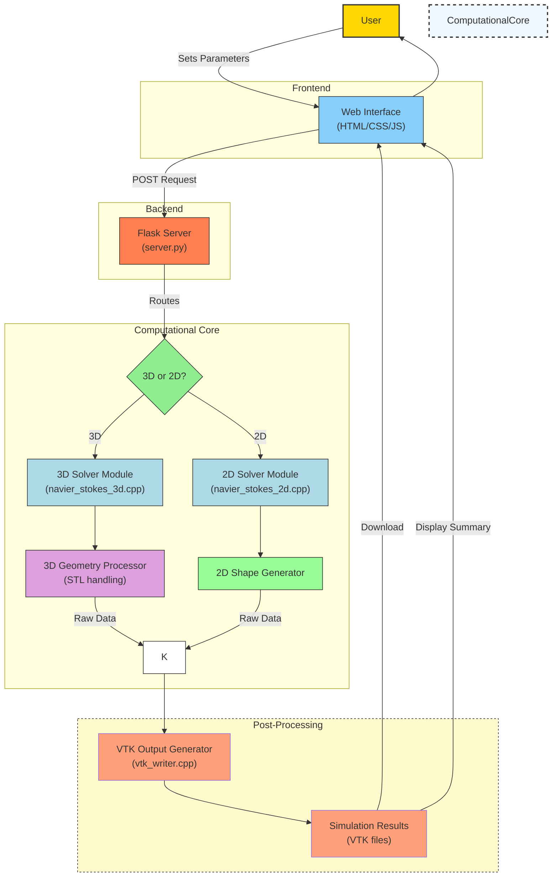

```mermaid
flowchart TD
    A[User] -->|Sets Parameters| B["Web Interface<br>(HTML/CSS/JS)"]
    B -->|POST Request| C["Flask Server<br>(server.py)"]
    C -->|Routes| E{"3D or 2D?"}
    
    subgraph Computational Core
        E -->|3D| F["3D Solver Module<br>(navier_stokes_3d.cpp)"]
        F --> H["3D Geometry Processor<br>(STL handling)"]
        
        E -->|2D| G["2D Solver Module<br>(navier_stokes_2d.cpp)"]
        G --> J["2D Shape Generator"]
        
        H & J -->|Raw Data| K
    end

    K --> M["VTK Output Generator<br>(vtk_writer.cpp)"]
    M --> L["Simulation Results<br>(VTK files)"]
    L -->|Download| B
    L -->|Display Summary| B --> A

    subgraph Frontend
        B
    end

    subgraph Backend
        C
        E
    end

    style A fill:#ffd700,stroke:#333,stroke-width:2px
    style B fill:#87cefa,stroke:#333
    style C fill:#ff7f50,stroke:#333
    style E fill:#90ee90,stroke:#333
    style ComputationalCore fill:#f0f8ff,stroke:#333,stroke-width:2px,stroke-dasharray:5 5
    style F fill:#add8e6,stroke:#333
    style G fill:#add8e6,stroke:#333
    style H fill:#dda0dd,stroke:#333
    style J fill:#98fb98,stroke:#333
    style K fill:#ffffff,stroke:#333,stroke-width:0  %% Invisible connector
    style M fill:#ffa07a,stroke:#333  %% VTK Generator
    style L fill:#ffa07a,stroke:#333  %% Output files

    %% Optional: Add a Post-Processing section
    subgraph Post-Processing
        M
        L
    end
    style Post-Processing fill:#fffacd,stroke:#333,stroke-dasharray:3 3
```
