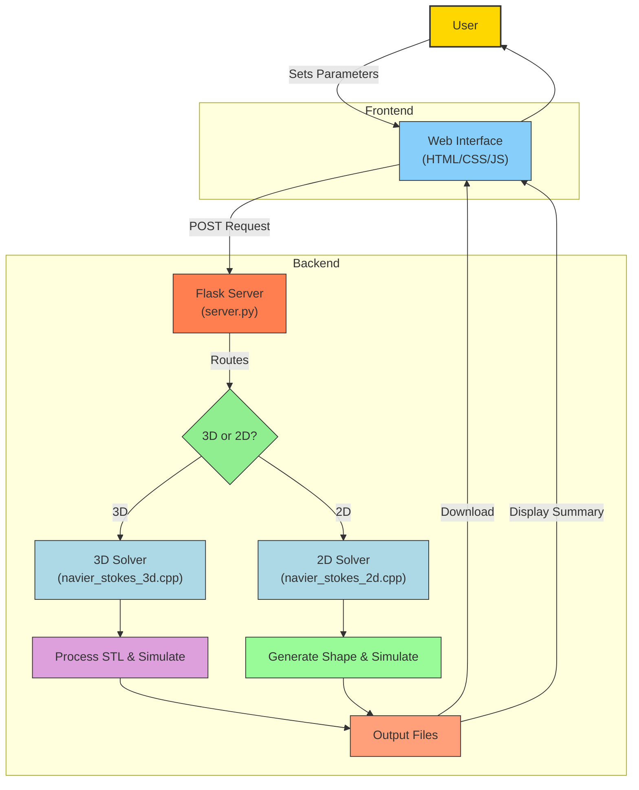

```mermaid
flowchart TD
    A[User] -->|Sets Parameters| B["Web Interface<br>(HTML/CSS/JS)"]
    B -->|POST Request| C["Flask Server<br>(server.py)"]
    C -->|Routes| E{"3D or 2D?"}
    
    E -->|3D| F["3D Solver<br>(navier_stokes_3d.cpp)"]
    F --> H["Process STL & Simulate"]
    
    E -->|2D| G["2D Solver<br>(navier_stokes_2d.cpp)"]
    G --> J["Generate Shape & Simulate"]
    
    H & J --> K["Output Files"]
    K -->|Download| B
    K -->|Display Summary| B --> A

    subgraph Frontend
        B
    end

    subgraph Backend
        C
        E
        F
        G
        H
        J
        K
    end

    style A fill:#ffd700,stroke:#333,stroke-width:2px
    style B fill:#87cefa,stroke:#333
    style C fill:#ff7f50,stroke:#333
    style E fill:#90ee90,stroke:#333
    style F fill:#add8e6,stroke:#333
    style G fill:#add8e6,stroke:#333
    style H fill:#dda0dd,stroke:#333
    style J fill:#98fb98,stroke:#333
    style K fill:#ffa07a,stroke:#333
```
