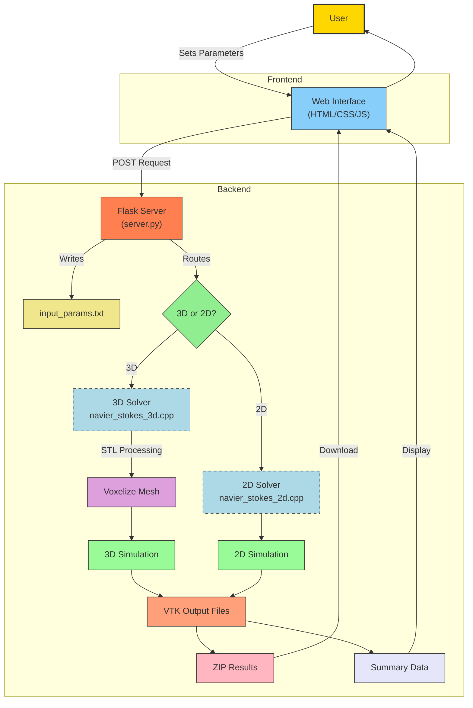

```mermaid
flowchart TD
    A[User] -->|Sets Parameters| B["Web Interface\n(HTML/CSS/JS)"]
    B -->|POST Request| C["Flask Server\n(server.py)"]
    C -->|Writes| D["input_params.txt"]
    C -->|Routes| E{"3D or 2D?"}
    E -->|3D| F["3D Solver\nnavier_stokes_3d.cpp"]
    E -->|2D| G["2D Solver\nnavier_stokes_2d.cpp"]
    F -->|STL Processing| H["Voxelize Mesh"]
    H --> I[3D Simulation]
    G --> J[2D Simulation]
    I & J --> K["VTK Output Files"]
    K --> L["ZIP Results"]
    L -->|Download| B
    K --> M["Summary Data"]
    M -->|Display| B --> A

    subgraph Frontend
        B
    end

    subgraph Backend
        C
        D
        E
        F
        G
        H
        I
        J
        K
        L
        M
    end

    style A fill:#ffd700,stroke:#333,stroke-width:2px
    style B fill:#87cefa,stroke:#333
    style C fill:#ff7f50,stroke:#333
    style D fill:#f0e68c,stroke:#333
    style E fill:#90ee90,stroke:#333
    style F fill:#add8e6,stroke:#333,stroke-dasharray:5
    style G fill:#add8e6,stroke:#333,stroke-dasharray:5
    style H fill:#dda0dd,stroke:#333
    style I fill:#98fb98,stroke:#333
    style J fill:#98fb98,stroke:#333
    style K fill:#ffa07a,stroke:#333
    style L fill:#ffb6c1,stroke:#333
    style M fill:#e6e6fa,stroke:#333
```
